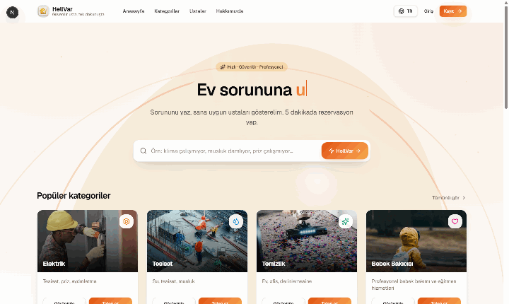
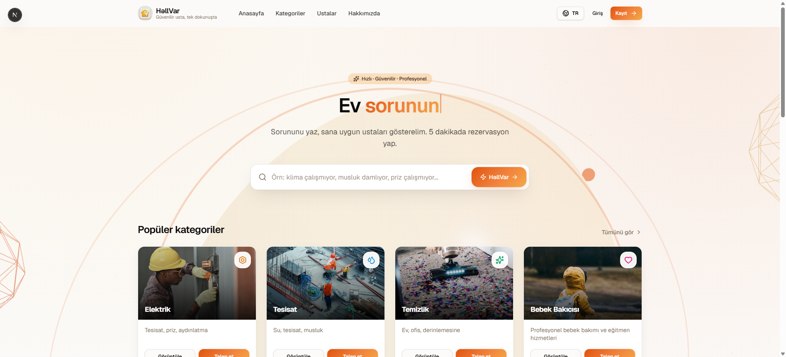
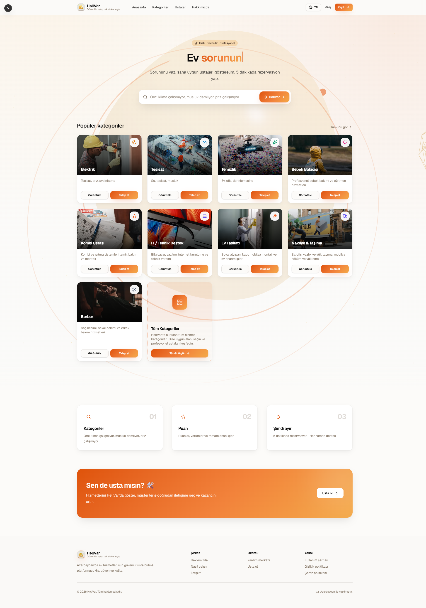
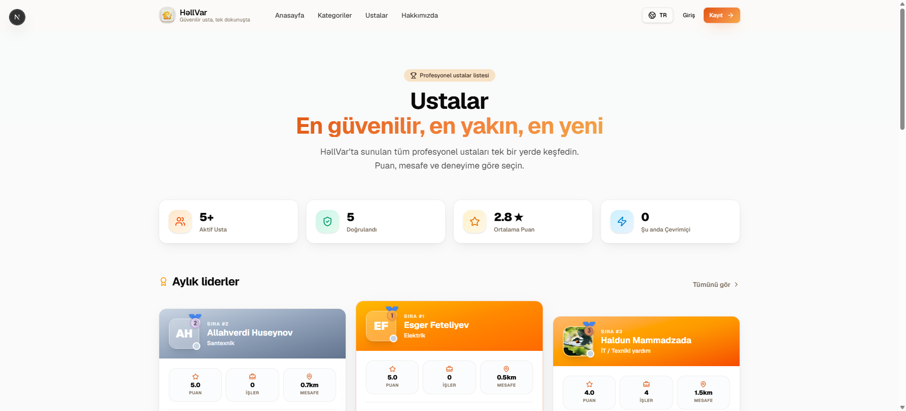
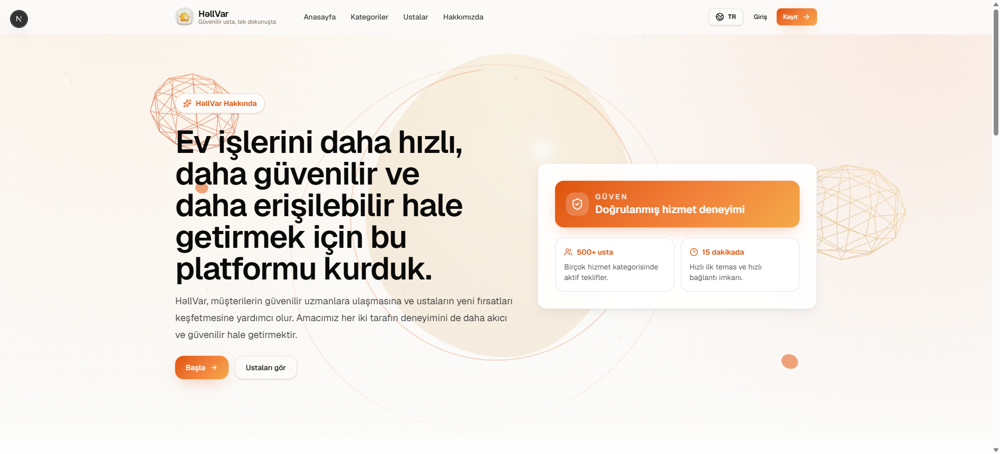
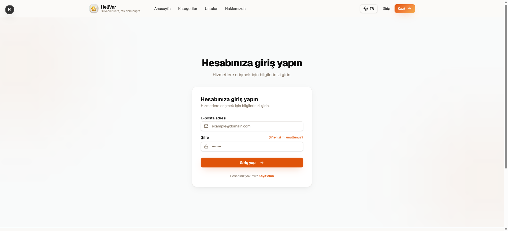
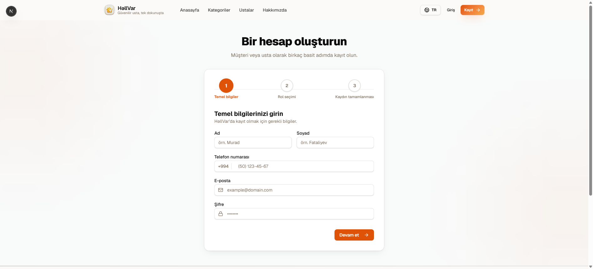

<div align="center">


# 🔧 UstaTap

### Ev Xidmətləri üçün Premium Onlayn Platforma

> **Etibarlı usta, bir toxunuşda.** Azərbaycanda ev xidmətlərini daha sürətli, daha etibarlı və daha rahat edən tam həll platforması.

[](https://nextjs.org)
[](https://react.dev)
[](https://www.typescriptlang.org)
[](https://tailwindcss.com)
[](https://supabase.com)
[](https://threejs.org)
[](https://groq.com)
[](https://ui.shadcn.com)

**Az · EN · TR · RU** &nbsp;·&nbsp; 🟢 Realtime &nbsp;·&nbsp; 🤖 AI Dəstəkli &nbsp;·&nbsp; 📅 Rezervasiya &nbsp;·&nbsp; ⭐ Reytinq & Rəylər

---

<!-- 📊 Canlı GitHub statistikaları (avtomatik yenilənir) -->
<div align="center">

[](https://github.com/fatalieff/UstaTap/stargazers)
[](https://github.com/fatalieff/UstaTap/forks)
[](https://github.com/fatalieff/UstaTap/watchers)
[](https://github.com/fatalieff/UstaTap/issues)

[](https://github.com/fatalieff/UstaTap/commits)
[](https://github.com/fatalieff/UstaTap/commits)
[](https://github.com/fatalieff/UstaTap)
[](https://github.com/fatalieff/UstaTap)

[](https://github.com/fatalieff/UstaTap)

</div>

</div>

---

## 🏠 Layihə haqqında

**UstaTap** — Azərbaycanda (Bakı və ətrafı) **ev xidmətləri** bazarını rəqəmsallaşdıran bir **onlayn xidmət platformasıdır**. Bu, sadəcə "usta axtarma" saytı deyil; müştəri ilə peşəkar ustaları etibarlı şəkildə birləşdirən, **axtarış → seçim → rezervasiya → realtime əlaqə → tamamlama** prosesinin hamısını bir yerdə idarə edən tam funksiyalı ekosistemdir.

Müştəri problemi yazır, **AI** uyğun istiqaməti təyin edir, sistem təsdiqlənmiş ustaları göstərir və müştəri bir neçə dəqiqə ərzində sifarişini verir. Ustalar isə paneldən sifarişləri qəbul edir, müştərilərlə çatda danışır və peşəkar profillərini idarə edir.

---

## 🎬 Canlı Demo

<div align="center">



*Ana səhifə · AI axtarış · 3D hero interaktiv səhnə*

</div>

---

## 🖼️ Ekran görüntüləri

<div align="center">

**🏠 Ana səhifə — Hero & AI axtarış**



---

**🗂️ Bütün kateqoriyalar**



---

**👷 Ustalar kataloqu**



---

**ℹ️ Haqqımızda**



---

**🔐 Giriş & Qeydiyyat**

 &nbsp; 

</div>

---

## ✨ Əsas xüsusiyyətlər

| | Xüsusiyyət | Təsvir |
|---|---|---|
| 🤖 | **AI Problem Analizi** | Problemi yazın — AI (Groq + Llama 3.3) dilinizi aşkarlayır (az/en/tr/ru), kateqoriyanı, məsləhəti və təcililik dərəcəsini təyin edir |
| 🔍 | **Ağıllı Axtarış & Filtrlər** | Reytinq, qiymət, təcrübə, tamamlanmış iş sayı, online status və iş radiusu üzrə filtrləmə |
| 📅 | **Rezervasiya (Booking) Sistemi** | Tarix + saat + müddət + qiymət təklifi ilə konkret ustadan sifariş; tam status maşını ilə idarə olunur |
| 💬 | **Realtime Çat** | Müştəri ilə usta arasında anında mesajlaşma (Supabase Realtime) |
| 🔔 | **Bildirişlər** | Sifariş, rəy və mesaj hadisələrində realtime push-bildirişlər (DB trigger ilə) |
| ⭐ | **Reytinq & Rəylər** | 5 ulduzlu rəy sistemi, avtomatik ortalama hesablanması (DB trigger) |
| 🛡️ | **Usta Təsdiqlənməsi** | Sənəd yükləmə + admin yoxlaması + "ŞV Təsdiqlənib" nişanı |
| 🗺️ | **Xəritə / Radius Görünüşü** | Müştəri panelində yaxınlıqdakı ustalar, radius slider ilə |
| 💼 | **Usta Paneli** | Həftəlik qazanc, tamamlanmış işlər, gözləyən sifarişlər, online/offline keçidi, sifariş idarəetməsi |
| ❤️ | **Favoritlər** | Sevimli ustaları saxlama (Zustand + localStorage) |
| 🧩 | **4 Dil Dəstəyi** | Azərbaycan, İngilis, Türk, Rus — tam i18n (az/en/tr/ru) |
| 🪪 | **Avatar Sistemi** | Supabase Storage üzərindən profil şəkli yükləmə |
| 🎨 | **3D Hero & Premium UI** | React Three Fiber ilə interaktiv 3D səhnə, Framer Motion animasiyaları |

---

## 🗂️ Xidmət kateqoriyaları

| | Kateqoriya | | Kateqoriya |
|---|---|---|---|
| ⚡ | **Elektrik** | 🛠️ | **Ev təmiri / Təmir** |
| 💧 | **Santexnika** | 🚚 | **Daşınma xidməti** |
| ❄️ | **Kondisioner** | 💻 | **İT / Texniki yardım** |
| 🔥 | **Kombi Ustası** | 🏠 | **Mebel Ustası** |
| 🧹 | **Təmizlik xidməti** | 🎨 | **Rəngsaz** |
| 👶 | **Dayə** | 🧱 | **Alçipan & Kafel Ustası** |
| ✂️ | **Bərbər** | 📦 | **Məişət avadanlığı təmiri** |

---

## ⚙️ Necə işləyir?

### Müştəri üçün

<div align="center">

| **1. Problemi yaz** | **2. Ustanı seç** | **3. Rezervasiya et** |
|:---:|:---:|:---:|
| AI problemini analiz edir, uyğun kateqoriyanı və məsləhəti verir | Reytinq, rəy, təcrübə və qiymətə görə təsdiqlənmiş ustanı seçir | Tarix, saat, müddət və qiymət təklifi ilə sifariş verir, çatda danışır |

</div>

### Usta üçün

<div align="center">

| **1. Qeydiyyat** | **2. Sənəd təsdiqi** | **3. Sifarişlər** |
|:---:|:---:|:---:|
| Kateqoriya, iş radiusu və sənədlərlə profil yaradır | Admin yoxlamasından keçir, "təsdiqlənmiş" nişanı qazanır | Panel üzərindən sifarişləri qəbul/redd edir, tamamlayır, qazancını görür |

</div>

---

## 📅 Rezervasiya (Booking) sistemi

Sifarişlər `PENDING` statusu ilə yaradılır və ciddi status maşını ilə qorunur:

```
                 ┌──────────────────────────┐
                 │  Müştəri "Sifariş ver"    │
                 └────────────┬─────────────┘
                              ▼
                          ┌────────┐
                          │PENDING │ ◄── ustanın gələn sifarişlərində görünür
                          └───┬────┘
           ┌──────────────────┼──────────────────┐
           ▼                  ▼                  ▼
     ┌──────────┐      ┌──────────┐        ┌──────────┐
     │ ACCEPTED │      │ REJECTED │        │ CANCELLED│
     └────┬─────┘      └──────────┘        └──────────┘
          ▼
     ┌──────────┐
     │COMPLETED │ ──► completed_jobs +1 (avtomatik)
     └──────────┘
```

| Status | Mənası | Kim dəyişir |
|---|---|---|
| `PENDING` | Yeni sifariş, ustaya düşür | Müştəri |
| `ACCEPTED` | Usta qəbul etdi | Usta |
| `REJECTED` | Usta redd etdi | Usta |
| `CANCELLED` | Müştəri ləğv etdi | Müştəri |
| `COMPLETED` | İş tamamlandı | Usta |
| `EXPIRED` | Vaxtı keçdi | Sistem |

> 🔒 Keçidlər **DB trigger** ilə qorunur; hər addımda tərəfə **realtime bildiriş** gedir və iş bitdikdə ustanın `completed_jobs` sayı avtomatik artır.

---

## 🛠️ Texnologiya stack

| Səviyyə | Texnologiya |
|---|---|
| **Frontend** | Next.js 16 (App Router) · React 19 · TypeScript 5 |
| **UI / Dizayn** | Tailwind CSS 4 · shadcn/ui · Radix UI · Lucide Icons · Framer Motion |
| **3D / Vizual** | Three.js · React Three Fiber · @react-three/drei |
| **Backend / DB** | Supabase (PostgreSQL · Auth · Realtime · Storage · RLS) |
| **State** | Zustand (favoritlər) · React Context (i18n) |
| **AI** | Groq API · Llama 3.3-70B-versatile |
| **Dialoq/Sheet** | Vaul (headless) |
| **i18n** | Az / En / Tr / Ru — 4 dil tam dəstək |

### Əsas paketlər

```json
{
  "next": "16.2.12",
  "react": "19.2.4",
  "typescript": "^5",
  "tailwindcss": "^4",
  "@supabase/supabase-js": "^2.112.0",
  "@react-three/fiber": "^9.7.0",
  "three": "^0.185.1",
  "framer-motion": "^12.43.0",
  "zustand": "^5.0.14",
  "vaul": "^1.1.2"
}
```

---

## 🗄️ Arxitektura & Layihə strukturu

```
UstaTap/
├── app/                        # Next.js App Router səhifələri
│   ├── page.tsx                # Ana səhifə (Hero + AI axtarış + kateqoriyalar)
│   ├── about/                  # Haqqımızda
│   ├── categories/             # Kateqoriya siyahısı + detal (filtrlər)
│   ├── technicians/            # Ustalar kataloqu + profil
│   ├── dashboard/              # Müştəri paneli (xəritə/siyahı)
│   ├── provider/dashboard/     # Usta paneli
│   ├── bookings/               # Sifarişlərim
│   ├── chat/                   # Realtime çat
│   ├── profile/                # Şəxsi profil idarəetməsi
│   ├── login/ · signup/        # Autentifikasiya
│   ├── onboarding/             # Qeydiyyat axını
│   └── api/ai-advice/          # Groq AI endpoint
├── components/
│   ├── booking/                # Rezervasiya dialoqu + sifariş siyahısı
│   ├── provider/               # Usta paneli komponentləri
│   ├── reviews/                # Rəy dialoqu
│   ├── home/                   # 3D scene, TiltCard, Typewriter
│   ├── layout/                 # Navbar, Footer, i18n switcher
│   └── ui/                     # shadcn/ui komponentləri
├── lib/
│   ├── i18n/                   # 4 dilli lüğətlər (az/en/tr/ru)
│   ├── supabase/               # Supabase klient + avatar
│   ├── store/                  # Zustand favoritlər store
│   └── types/                  # Database tipləri
├── supabase/migrations/        # DB migration-lar (RLS, trigger, realtime)
└── middleware.ts               # Auth qoruyucu middleware
```

---

## 🚀 Başlamaq üçün

### 1. Klonlayın

```bash
git clone https://github.com/fatalieff/UstaTap.git
cd UstaTap
```

### 2. Paketləri quraşdırın

```bash
npm install
```

### 3. Ətraf mühit dəyişənlərini qurun

`.env.local` faylı yaradın:

```env
NEXT_PUBLIC_SUPABASE_URL=your-supabase-url
NEXT_PUBLIC_SUPABASE_ANON_KEY=your-anon-key
GROQ_API_KEY=your-groq-api-key
```

### 4. Verilənlər bazasını qurun

`supabase/migrations/` fayllarını **Supabase SQL Editor**-da sıra ilə işə salın — cədvəllər, RLS, trigger-lər və realtime avtomatik qurulacaq.

### 5. Tətbiqi işə salın

```bash
npm run dev
```

🌐 **http://localhost:3000** ünvanında açın.

---

## 📜 Əlverişli skriptlər

| Skript | İzah |
|---|---|
| `npm run dev` | Tərtibat (development) server |
| `npm run build` | Production build |
| `npm run start` | Production server |
| `npm run lint` | ESLint yoxlaması |

---

## 🔐 Təhlükəsizlik

- **Row Level Security (RLS)** — istifadəçilər yalnız öz məlumatlarına giriş əldə edir (müştəri öz sifarişləri, usta öz profili).
- **Trigger-lər** status keçidlərinin qanuniliyini qoruyur və bildirişləri `security definer` funksiyalar vasitəsilə yaradır.
- **Middleware** qorunan səhifələri (dashboard, profile, provider, bookings) avtorizasiyasız istifadəçilərdən mühafizə edir.

---

## 🗺️ Yol xəritəsi (Roadmap)

- [x] MVP: AI axtarış, kateqoriyalar, usta kataloqu, reytinq, çat, bildirişlər
- [x] Rezervasiya (booking) sistemi + status maşını
- [ ] 📅 İş saatları & təqvim (`provider_availability`)
- [ ] 💳 Kart ödənişi & escrow sistemi
- [ ] 📈 Usta üçün analitika & statistika
- [ ] 📱 Mobil tətbiq (React Native / PWA)

---

## 🤝 Töhfə vermək

Layihəyə töhfə vermək istəyirsinizsə:

1. Reponu fork edin
2. Yeni branch yaradın (`git checkout -b feature/amazing-feature`)
3. Dəyişikliklərinizi commit edin
4. Pull Request açın

---

<div align="center">

**Made with ❤️ in Azerbaijan** 🇦🇿

© UstaTap — Bütün hüquqlar qorunur.

</div>
